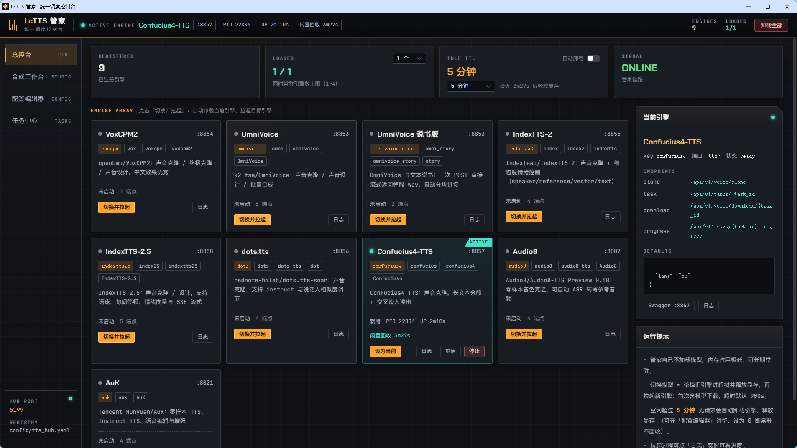
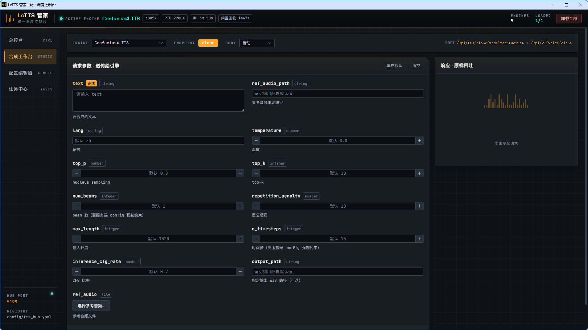
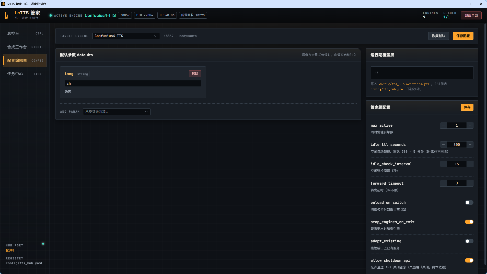
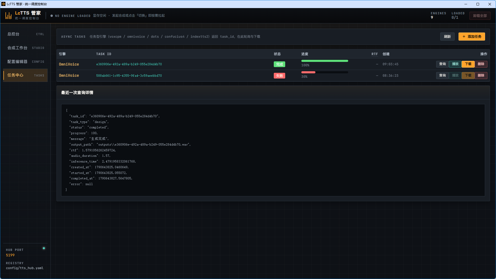

# Open TTS Server Hub

> 一个 Python 环境，聚合当下最热门的开源 TTS 引擎；统一 API、统一模型管理、统一测试页 —— 告别为每个引擎重复搭环境的痛苦。

[](LICENSE)
[](https://www.python.org)
[](https://fastapi.tiangolo.com)

---

## 为什么需要它

玩过多个开源 TTS 项目的人都知道：每个项目都有自己的 Python 版本、自己的 `transformers`/`torch` 补丁、自己的模型下载方式。
想在同一台机器上同时用 IndexTTS、OmniVoice、VoxCPM、AuK…… 往往要切来切去地重建环境，磁盘和显存都被重复占用。

**Open TTS Server Hub** 把这 8 个热门开源 TTS 引擎收进**同一个仓库、同一个 Python 3.12 环境**，并统一封装成一套 API：
你只装一次依赖，就能按需调用任意引擎，用到哪个接口才下载哪个模型。

---

## ✨ 核心优势

### 1. 一个环境解决所有热门 TTS 开源项目
无需为每个引擎单独搭建、复制、维护一套 Python 环境。
所有引擎共享同一份依赖与工具层（`tools/`），并统一接入模型缓存（`models/`），互不复刻权重。

已加入的开源 TTS 项目：

| 引擎目录 | 上游开源项目 | 默认端口 | 主要能力 |
| --- | --- | --- | --- |
| `Audio8_TTS` | [Audio8/Audio8-TTS](https://github.com/Audio8/Audio8-TTS)（Preview 0.6B） | 8007 | 音色克隆 / 纯文本合成 |
| `AuK` | [Tencent-Hunyuan/AuK](https://github.com/Tencent-Hunyuan/AuK)（+AuK-Flash） | 8021 | 零样本 TTS、Instruct TTS、语音编辑/增强 |
| `Confucius4-TTS` | Confucius4-TTS | 8857 | 声音克隆 |
| `dots` | [rednote-hilab/dots.tts-soar](https://github.com/rednote-hilab/dots.tts) | 8856 | 声音克隆 / 设计 |
| `index_tts2` | [IndexTeam/IndexTTS-2](https://github.com/index-team/IndexTTS) | 8855 | 声音克隆 / 情绪控制 |
| `index_tts25` | IndexTTS-2.5 | 8858 | 声音克隆 / 设计（新版） |
| `omnivoice` | [k2-fsa/OmniVoice](https://github.com/k2-fsa/OmniVoice) | 8853 | 声音克隆 / 设计 |
| `VoxCPM` | [openbmb/VoxCPM2](https://github.com/OpenBMB/VoxCPM) | 8854 | 声音克隆 / 终极克隆 / 设计 |
| `breeze_tts` | [breezeblue-ai/Breeze-TTS-2](https://modelscope.cn/models/BreezeBlue/Breeze-TTS-2)（ModelScope） | 8860 | 声音克隆 / 声音引导 / 声音设计（24kHz 中英双语，需 CUDA） |

### 2. 完善的 API 接口 + 调用文档 + 一键生成调用 Skill
每个引擎都封装为独立的 **FastAPI** 服务（`*_api_server.py`），接口风格高度统一：

- 健康检查：`GET /api/health`
- 声音克隆：`POST /api/v1/voice/clone`
- 声音设计：`POST /api/v1/voice/design`

每个服务自带 **Swagger / OpenAPI 文档**（`http://localhost:<端口>/docs`），参数、响应一目了然。

并且项目内置可直接复用的 **Agent 调用 Skill**（如 `omnivoice-tts-skill/SKILL.md` + `invoke_tts_api.py`），
配合统一 OpenAPI，可为任意引擎快速派生出"交给 AI Agent 一键调用"的 Skill，让智能体直接操作本地 TTS 服务。

### 3. 便捷的测试页面与 WebUI
- 根目录提供**聚合测试与调用平台** `api_聚合快速调用测试.html`：一个页面同时勾选、对比、调用全部引擎，
  自带差异化参数面板（语速、方言、情绪、去噪、随机采样等）。
- 各引擎也自带 WebUI（如 `index_tts25/webui.py`、`index_tts2/webui.py`、`Audio8_TTS/WebUI.py`、`AuK/app.py`），开箱即用。

### 4. 线程优化 + flash_attn 加速
- API 服务基于**异步 + 线程池**架构，支持并发合成与轮询式任务，充分利用多核算力，提升批量/并行请求吞吐。
- 集成 **FlashAttention（`flash_attn==2.8.3`）** 加速注意力计算，降低显存占用、提升推理速度；
  Windows 预编译 wheel 已归档于 `whl/`（见下方「依赖与 flash_attn」）。

### 5. 模型自动化管理（用到即下，国内源）
模型统一由 `tools/models_manager.py` 管理，首次调用接口时**按需自动下载**，并存于 `models/`：

- 支持 **HuggingFace Hub** 与 **ModelScope（魔搭，国内镜像）** 双来源；
- 按引擎登记所需文件（`required_files` / `allow_patterns`），只拉取推理必需权重，不浪费带宽；
- 模型自动缓存、跨引擎复用（`candidate_dirs`），避免重复下载。

国内网络环境下优先走 ModelScope 等镜像，下载更快更稳。

### 6. LcTTS 管家控制台：一个端口调用全部引擎，一套面板管住全部

`启动TTS管家桌面端.bat` 拉起一个**常驻的 FastAPI 管家**（默认 `5199`，刻意避开常用端口），它自己不加载任何模型：

- **以 `model` 名称驱动**：请求带 `?model=voxcpm`，管家就拉起 VoxCPM；换成 `?model=index25` 就
  **自动卸载当前引擎、释放显存，再拉起目标引擎**继续配音。
- **全透传**：输入参数、multipart 参考音频、SSE 进度流、wav 二进制输出全部原样转发/回吐。
- **统一注册 + 在线配置**：`config/tts_hub.yaml` 注册所有引擎的启动方式与参数表；
  `GET /api/hub/engines/{name}/params` 查询支持参数，`PUT /api/hub/engines/{name}/config` 在线改默认参数（持久化）。
- **配额与空闲回收**：同时常驻上限可在 **1~4** 之间在线调整（允许引擎并存，超上限按最久未使用淘汰）；
  默认空闲 **5 分钟**自动卸载释放显存，正在拉起的引擎不会被误杀。
- **可视化控制台**：总控台 / 合成工作台 / 配置编辑器 / 任务中心，四个面板见下方专章。

```bash
POST http://localhost:5199/api/tts?model=voxcpm      # 自动拉起 VoxCPM 并透传合成
GET  http://localhost:5199/api/hub/engines/voxcpm/params
POST http://localhost:5199/api/hub/unload            # 释放显存
```

---

## 🎛 LcTTS 管家控制台

打开 <http://localhost:5199/ui>，或双击 **`启动TTS管家桌面端.bat`** —— 管家后台无窗口常驻，
自动等待就绪后用浏览器「应用模式」开一个 1920×1080 的独立窗口（无地址栏、无标签页，像桌面软件）。
技术栈 Vue 3 + Element Plus，产物随仓库发布，**运行时不需要 Node**。

### 总控台 —— 谁在跑、还剩多久被回收



- **引擎卡片墙**：9 个引擎一屏看完 —— 状态灯、端口、PID、运行时长、闲置回收倒计时、在途请求数，
  活跃引擎带 `ACTIVE` 角标，拉起中/失败用不同颜色区分
- **概览区直接调参**：常驻上限（1~4）、是否常驻 / 空闲回收时长，改完 **即时下发，无需重启**
- **日志抽屉**：实时 tail 引擎子进程日志 —— 模型下载进度、加载日志、报错堆栈都在这
- **当前引擎面板**：端点表 + `defaults` 速览 + 一键打开该引擎自己的 Swagger

### 合成工作台 —— 参数表单跟着引擎自动变



- 表单由 `GET /api/hub/engines/{name}/params` 的 schema **自动渲染**：滑块 / 开关 / 枚举下拉 /
  多行文本 / 参考音频上传，必填字段高亮，每个参数带类型标签与中文说明
- **新增引擎只改 `config/tts_hub.yaml`，前端零改动** —— 参数表怎么变，表单就怎么变
- 顶部一行切换引擎、endpoint（`clone` / `design` / `ultimate_clone`…）、请求体格式（自动 / Form / JSON），
  并实时显示真实转发目标 `POST /api/tts/clone?model=... → /api/v1/voice/clone`
- 结果区**原样回吐**：音频直接播放 / 下载；返回 `task_id` 的异步任务自动进任务中心

### 配置编辑器 —— 在线调参，不用改文件重启



- 表单化编辑各引擎 `defaults`（可从参数表补加键），保存即持久化，也可一键恢复默认
- 改动写入 `config/tts_hub.overrides.yaml` 覆盖层，**不污染主注册表的注释与结构**
- 管家级配置：常驻上限、空闲回收与巡检间隔、转发超时、端口接管、关闭接口开关

### 任务中心 —— 异步任务、进度与生成速率



- 2.5s 自动轮询任务进度，完成后一键下载
- **RTF 列**：生成速率一目了然（`<1` 绿 = 快于实时 / `<2` 黄 / `≥2` 红），
  悬停可看音频时长与推理耗时
- **「播放」按钮懒加载音频** —— 点击才去拉取字节并缓存，不预取、不占带宽

> 完整的接口清单、model 映射、透传规则与排错见 [docs/TTS管家使用文档.md](docs/TTS管家使用文档.md)。

---

## 项目结构

```
Open-TTS-SeverHub/
├── audio8_api_server.py      # Audio8  API 服务
├── auk_api_server.py         # AuK     API 服务
├── confucius4_api_server.py   # Confucius4-TTS API 服务
├── dots_tts_api.py           # dots.tts API 服务
├── index_tts25/index_api_server.py   # IndexTTS-2.5 API 服务
├── omnivoice/omni_api_server.py       # OmniVoice API 服务
├── VoxCPM/voxcpm-api_server.py        # VoxCPM API 服务
├── api_聚合快速调用测试.html   # 聚合测试/调用平台
├── tts_hub_server.py         # 【TTS API 管家】启动入口（默认 5199）
├── tts_hub/                  # 【TTS API 管家】注册表 / 进程管理 / 透传 / 服务
│   ├── static/               # 控制台前端构建产物（Vue3 + Element Plus，已随仓库发布）
│   └── images/               # README 界面截图
├── frontend/                 # 控制台前端源码（Vue3 + Vite；仅开发期需 Node）
├── config/tts_hub.yaml       # 【TTS API 管家】全部引擎的注册源（启动方式·端点·参数表）
├── tools/                    # 共享工具层：模型管理 / ASR / 文本归一化
│   ├── models_manager.py     # 模型自动下载与管理
│   ├── asr.py                # Whisper 语音识别（克隆参考文本）
│   └── text_normalize.py     # 中英文文本规范化
├── packages/index25/        # 补丁版 transformers 等（开箱即用，已随仓库）
├── Audio8_TTS/  AuK/  Confucius4-TTS/  dots/  index_tts2/  index_tts25/  omnivoice/  VoxCPM/
├── whl/                      # Windows 预编译 wheel（如 flash_attn，不入库）
├── models/                   # 模型权重（运行时自动下载，不入库）
├── requirements.txt          # 共享层运行时依赖
├── docs/依赖说明.md           # 详细依赖与安装说明
└── .gitattributes            # 超大词典（unidic sys.dic 179MB）走 Git LFS
```

---

## 快速开始

### 1. 克隆仓库

```bash
git clone https://github.com/licorxj/Open-TTS-ServerHub.git
cd Open-TTS-SeverHub
```

### 2. 准备 Python 3.12 环境

```bash
python -m venv py312env
py312env\Scripts\activate        # Windows
# source py312env/bin/activate   # Linux / macOS

python -m pip install -U pip
pip install -r requirements.txt   # 共享聚合层依赖
```

> 各引擎还有自己的依赖（见各自 `requirements.txt` / `pyproject.toml`），按需安装。
> **IndexTTS-2.5** 依赖补丁版 transformers，需使用专属环境 `index25env` 并把 `packages/index25` 置于 `PYTHONPATH` 最前。
> 详见 [docs/依赖说明.md](docs/依赖说明.md)。

### 3. 安装 flash_attn（可选加速，Windows）

```bash
pip install --no-deps whl/flash_attn-2.8.3+cu128torch2.8-cp312-cp312-win_amd64.whl
```

> 版本须与本地 python(3.12) / torch(2.8+cu128) / CUDA(12.8) 严格匹配；其他平台请按官方说明安装对应 wheel。

### 4. 启动引擎 API 服务

仓库根目录提供一键启动脚本（`.bat`），例如：

```bash
启动_omnivoice_api.bat      # OmniVoice  -> 8853
启动_vox_api.bat            # VoxCPM     -> 8854
启动_index_api.bat          # IndexTTS-2 -> 8855
启动_dots_api.bat           # dots.tts   -> 8856
启动_confucius4_api.bat     # Confucius4 -> 8857
启动_index25_api.bat        # IndexTTS-2.5 -> 8858
启动_audio8_api.bat         # Audio8     -> 8007
启动_auk_api.bat            # AuK        -> 8021
启动TTS管家桌面端.bat        # 桌面端     -> 后台无窗口常驻 + 应用模式打开面板（日常用这个）
关闭TTS管家桌面端.bat        # 关闭桌面端 -> 走 API 优雅退出，先卸载引擎释放显存
启动_TTS管家.bat             # 统一管家   -> 5199（前台运行，看实时日志）
启动_TTS管家_开发.bat        # 开发模式   -> 后端 5199 + Vite 5180（改前端免 build，需 Node）
```

只想开一个端口、按需切换引擎时，用 **`启动TTS管家桌面端.bat`**（后台常驻 + 独立应用窗口）或
`启动_TTS管家.bat`（前台看日志）即可，不必逐个启动引擎服务；要改控制台前端代码时用
`启动_TTS管家_开发.bat`（热更新）。

或手动启动任一服务：

```bash
python omnivoice/omni_api_server.py --host 0.0.0.0 --port 8853 --device auto
```

首次调用某引擎接口时，模型会经 `tools/models_manager` 自动下载到 `models/`。

### 5. 打开测试页 / WebUI

- 双击根目录 `api_聚合快速调用测试.html`，在浏览器中勾选引擎、填写文本与参考音频，即可对比调用全部 TTS 服务。
- 各引擎 WebUI：`python index_tts25/webui.py` 等。

---

## API 调用

每个引擎都是一个独立的 FastAPI 服务，可**直连调用**（不经管家）。端口与主要端点：

| 引擎 | 端口 | 健康检查 | 声音克隆 | 声音设计 | 任务型 |
| --- | --- | --- | --- | --- | --- |
| OmniVoice | 8853 | `/health` | `/api/v1/voice/clone` | `/api/v1/voice/design` | 是 |
| OmniVoice 说书版 | 8853 | 无 | `/tts`（流式返回 wav） | — | 否 |
| VoxCPM | 8854 | `/health` | `/api/v1/voice/clone` | `/api/v1/voice/design` | 是 |
| IndexTTS-2 | 8855 | `/health` | `/api/v1/voice/clone` | — | 是 |
| dots.tts | 8856 | `/health` | `/api/v1/voice/clone` | — | 是 |
| Confucius4-TTS | 8857 | `/health` | `/api/v1/voice/clone` | — | 是 |
| IndexTTS-2.5 | 8858 | `/api/health` | `/api/tts`（JSON） | — | 否 |
| Audio8 | 8007 | `/health` | `/tts` | — | 否 |
| AuK | 8021 | `/health` | `/v1/generate` | — | 否 |
| Breeze-TTS-2 | 8860 | `/health` | `/api/v1/voice/clone` | `/api/v1/voice/design` | 是 |

> ⚠ OmniVoice 与说书版端口都是 `8853`，同时只能开一个。

### 调用示例（克隆）

```bash
curl -X POST http://localhost:8854/api/v1/voice/clone \
  -F "text=今天天气真不错" \
  -F "ref_audio_path=VoxCPM/examples/example.wav" \
  -F "language=zh"
```

- 完整参数表、请求体格式、curl / Python / JS 示例、异步任务轮询流程见
  **[docs/直连调用TTS文档.md](docs/直连调用TTS文档.md)**
- 每个服务自带 **Swagger**：`http://localhost:<端口>/docs`（参数与响应以它为准）
- 想交给 AI Agent 调用？参考 `omnivoice-tts-skill/SKILL.md`，并基于对应 `/docs` 为任意引擎快速生成调用 Skill。

---

## 模型自动化管理

`tools/models_manager.py` 以 `MODEL_REGISTRY` 登记各引擎模型来源与所需文件：

- `vox` / `omnivoice` / `audio8`：HuggingFace Hub
- `indextts` / `dots` / `auk` / `auk_flash` / `qwen_omni`：ModelScope（国内镜像，下载更快）
- 首次调用接口时自动 `snapshot_download` 至 `models/`，后续直接复用；
- 支持 `allow_patterns` 只拉推理必需文件，并支持跨引擎候选目录复用。

---

## 依赖与 flash_attn

- 共享层依赖见根目录 `requirements.txt`（FastAPI / uvicorn / huggingface_hub / modelscope / torch / transformers 等）。
- 各引擎差异依赖见各自 `requirements.txt` / `pyproject.toml`。
- `flash_attn==2.8.3`（cu128 / torch2.8 / cp312 / win_amd64）预编译 wheel 归档于 `whl/`，用于加速注意力计算。
- 完整安装顺序、版本补丁（`packages/index25`）、模型下载与启动入口见 [docs/依赖说明.md](docs/依赖说明.md)。

---

## 文档

- [LcTTS 管家接口文档](docs/LcTTS管家接口文档.md)：**管家 HTTP API 完整参考** —— 22 个端点的参数与真实响应、
  合成透传规则（model 三种传法 / 请求体格式 / 响应保真）、错误码、Python 与 JS 完整封装示例。
- [直连调用 TTS 文档](docs/直连调用TTS文档.md)：**绕过管家直连各引擎** —— 端口速查、9 个引擎的完整参数表、
  curl / Python / JS 示例、异步任务轮询与 RTF 说明、常见问题。
- [TTS 管家使用文档](docs/TTS管家使用文档.md)：启动方式、面板四个模块、配置说明、运行机制与排错。
- [依赖说明](docs/依赖说明.md)：结构、Python 环境、共享层与各引擎依赖对照、补丁说明、安装顺序、模型下载与启动入口。
- [Breeze-TTS-2 调用文档](docs/Breeze-TTS-2调用文档.md)：第九个引擎 Breeze-TTS-2 的端点 / 参数 / curl·Python 示例 /
  经管家调用 / 模型自动下载与 `breezeenv` 隔离环境说明。

---

## 许可证与声明

- 本仓库为各开源 TTS 引擎的**聚合与统一封装**，各引擎的权重与代码版权归其原始开源项目所有，使用时请遵守各自许可证。
- 模型权重**不随仓库分发**，运行时应按各引擎许可从官方/HuggingFace/ModelScope 下载。
